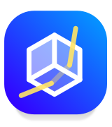
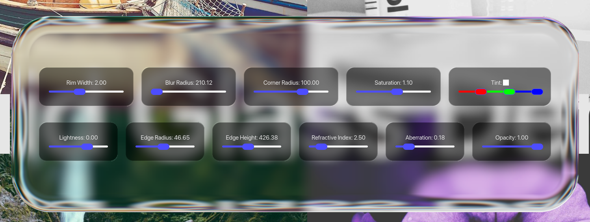
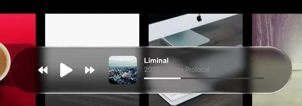
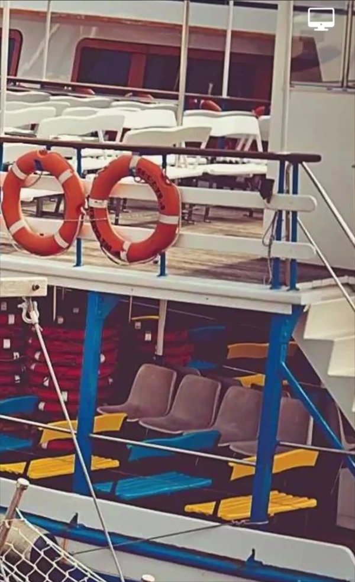
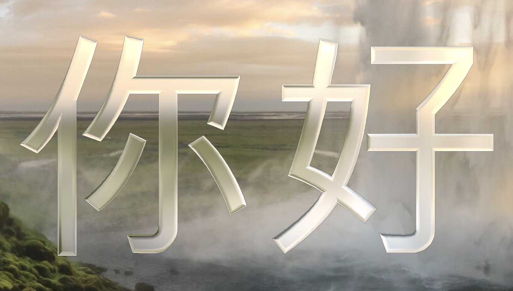

<div align="center">



# Iced Glass

[](https://github.com/maxbergmark/iced_glass/actions)


</div>

A Rust library and demo app that implements Apple-style **liquid / frosted glass** UI effects using [Iced](https://github.com/iced-rs/iced) and custom WGPU shader pipelines.





## Text



With the rewrite of the refraction math using signed distance functions, it is now possible to render text with refraction. This is still a work in progress, as characters are rendered one at a time. Each glyph is rasterized into an MSDF atlas on first use and cached for subsequent frames. The SDF is then used in the fragment shader both for inside/outside testing and to drive the refraction and rim-light effects, giving text the same glass appearance as iced_glass::widget::container.

### Limitations

- <s>Font selection is not possible at this time. This will be added before the feature is completed</s>
- GPU textures are a bit wasteful to simplify the implementation. Hopefully this will get fixed
- <s>Due to starting from a `container` widget, the interface is slightly different than the original `text` widget. This will be addressed</s>

## Usage

This crate is meant to be a drop-in replacement for existing iced widgets, making it possible to add extra styling for liquid glass-like effects.

```rust
impl Ui {

    // view using regular container
    fn view(&self) -> Element<'_, Message> {
        iced::widget::container(
            self.content()
        )
        .into()
    }

    // same view using iced_glass, with styling options
    fn glass_view(&self) -> Element<'_, Message> {
        iced_glass::widget::container(
            self.content()
        )
        .glass_style(|_theme| {
            blur_radius: 10.0, // gaussian blur
            saturation: 0.8, // add or remove saturation from background texture
            lightness: -2.0, // tint glass lighter or darker in exposure steps
            edge_radius: 20.0, // bevel radius of container
            edge_height: 100.0, // accentuate refraction by adding depth
            refractive_index: 1.5, // amount of refraction
            rim_width: 2.0, // rim highlight
            opacity: 1.0, // select opacity, useful for fade-in effects
            edge_type: EdgeType::GlassEdge // choose between refractive glass edges or smooth fade-in

        })
        .into()
    }
}

```

## What it does

`iced_glass` captures the framebuffer region behind a widget, applies a separable Gaussian blur, then composites a final fragment pass that adds:

- **Frosted glass blur** with configurable radius
- **Refraction** — Snell's-law-based UV offsets that simulate light bending through a glass surface
- **Saturation and lightness** grading (dark/tinted glass via linear-space exposure)
- **Rim highlights** — angle-dependent edge glow along the rounded-rect SDF
- **Rounded corners** and **opacity** controls

All rendering happens on the GPU via WGSL shaders (`fragment.wgsl` / `text.wgsl` for the composite pass, `gaussian.wgsl` for the separable blur, `downsample.wgsl` for downsampling before blurring, and upsampling after blurring).

## Widgets

The library exposes two custom Iced widgets:

| Widget | Description |
|--------|-------------|
| `iced_glass::widget::container` | A drop-in container with glass effect. Supports all standard container properties (padding, alignment, clipping) plus glass parameters: `blur_radius`, `saturation`, `lightness`, `edge_radius`, `edge_height`, `refractive_index`, `rim_width`, `opacity`. |
| `iced_glass::widget::slider` | An Iced-compatible slider whose handle renders with the glass primitive while dragging. Exposes `edge_radius`, `edge_height`, and `refractive_index` for the handle effect. |
| `iced_glass::widget::text` | A drop-in text widget that renders glyphs using MSDF (Multi-channel Signed Distance Field) textures and the same glass shader pipeline as the container. Supports all standard text properties (`size`, `font`, `line_height`, `shaping`, `wrapping`, alignment) plus glass parameters: `blur_radius`, `saturation`, `lightness`, `edge_radius`, `edge_height`, `refractive_index`, `rim_width`, `opacity`. |


More widgets are planned to be added.

### Roadmap

- [x] Add support for tinted glass
    - <s>This might move the opacity selector into the style of the widget. </s> For now, opacity remains as a standalone option, since it works a bit differently than tinting.
    - For now, only flat colors are available when tinting, and they are configured by adding a background to the element
- [x] Add downsampling and upsampling to improve blur performance
- [ ] Add `Button` widget with default styling
- [ ] Add `Toggle` widget with default styling
- [x] Add `Text` widget with default styling
- [ ] Add configurable chromatic aberration
- [x] Add timing metrics for GPU shader stages
    - This has been tested locally, but it requires enabling feature flags on device creation in iced. 

## Performance

The most expensive rendering step is the blur pass. Initially, this was done as a single 2D sampling render pass. Currently, blurring is handled through downsampling + separated gaussian blur + upsampling, which greatly improves performance while blurring. The actual liquid glass sampling stage is quite cheap, since it only samples a single pixel after doing some math. Even with chromatic aberration, it will remain relatively cheap.

The main bottleneck in terms of performance for these widgets is the amount of render passes issued. Since each component keeps track of its own background textures, and gaussian blurring is done through the use of mipmaps, there are up to 11 render passes per widget. And each widget is rendered separately, which issues a lot of render passes if multiple liquid glass element are in the same view. There are no current plans to improve performance. As long as there are fewer than 20 liquid glass elements on the screen at a given time, performance should be excellent.

### Benchmark

Here is a benchmark from the scene defined in `scenes/basic.rs`, running on an M1 Macbook Pro:

```
downsample: 485.19µs
h_blur: 480.44µs
v_blur: 483.40µs
upsample: 402.96µs
fragment: 333.28µs
total: 2185.27µs
fps: 457.61
```

## Demo scenes

The binary crate includes three demo scenes, selectable at runtime:

- **Basic** — A 2×2 photo wallpaper grid with a draggable glass panel. Sliders inside the panel control every glass parameter in real time.
- **ScrollView** — A mock music browser with a scrollable album grid (loaded from `albums.json`), a frosted-glass search bar, and a playback bar with a glass slider for scrubbing.
- **LargeSlider** — A stress-test scene with an oversized glass slider on a gradient background, plus standard sliders to tune the refraction parameters.
- **StressTest** - A proper stress-testing scene which adds a lot of liquid glass containers to check performance.
- **Text** - A test scene for all text-related styling options, along with a dynamic text input which renders to a liquid glass text widget

## Dependencies

| Crate | Purpose |
|-------|---------|
| `iced` | GUI framework (custom fork with `wgpu`, `image`, `advanced`, `svg`, `tokio` features) |
| `iced_wgpu` | Low-level WGPU integration for custom shader primitives |
| `wgpu` | GPU abstraction layer |
| `bytemuck` | Safe transmutes for uniform buffers |
| `num-traits` | Numeric trait bounds for the slider |
| `serde` / `serde_json` | Album metadata deserialization |
| `itertools` | Chunked iteration for album grid layout |

Note: `serde` and `itertools` are only used for the demo, not in the library code.

## Building and running

```bash
cargo run
```

Requires a GPU that supports WGPU. The app opens at 2560x1440 by default.

> **Note:** This project depends on a [custom iced fork](https://github.com/maxbergmark/iced) (`latest` branch) for the shader primitive API. Currently, it is not possible to read from the background texture during rendering, which is needed for an effect like this. I'm aiming to get the changes merged into iced in the future.
