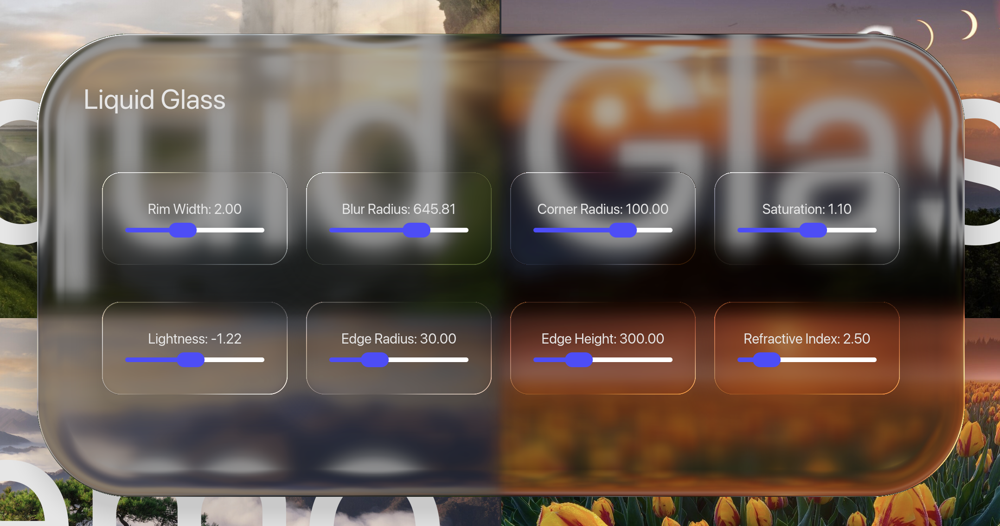

# Iced Glass



<video src="examples/liquid_glass_video_example.mp4" width="600" controls></video>

A Rust library and demo app that implements Apple-style **liquid / frosted glass** UI effects using [Iced](https://github.com/iced-rs/iced) and custom WGPU shader pipelines.


## Usage

This crate is meant to be a drop-in replacement for existing iced widgets, 

```rust
impl Ui {

    // view using regular container
    fn view(&self) -> Element<'_, Message> {
        iced::widget::container(
            self.content()
        )
        .into()
    }

    // same view using iced_glass, with styling options
    fn glass_view(&self) -> Element<'_, Message> {
        iced_glass::widget::container(
            self.content()
        )
        .blur_radius(10.0) // gaussian blur
        .saturation(0.8) // add or remove saturation from background texture
        .lightness(-2.0) // tint glass lighter or darker in exposure steps
        .edge_radius(20.0) // bevel radius of container
        .edge_height(100.0) // accentuate refraction by adding depth
        .refractive_index(1.5) // amount of refraction
        .rim_width(2.0) // rim highlight
        .opacity(1.0) // select opacity, useful for fade-in effects
        .into()
    }
}

```

## What it does

`iced_glass` captures the framebuffer region behind a widget, applies a separable Gaussian blur, then composites a final fragment pass that adds:

- **Frosted glass blur** with configurable radius
- **Refraction** — Snell's-law-based UV offsets that simulate light bending through a glass surface
- **Saturation and lightness** grading (dark/tinted glass via linear-space exposure)
- **Rim highlights** — angle-dependent edge glow along the rounded-rect SDF
- **Rounded corners** and **opacity** controls

All rendering happens on the GPU via WGSL shaders (`fragment.wgsl` for the composite pass, `gaussian.wgsl` for the separable blur).

## Widgets

The library exposes two custom Iced widgets:

| Widget | Description |
|--------|-------------|
| `iced_glass::widget::container` | A drop-in container with glass effect. Supports all standard container properties (padding, alignment, clipping) plus glass parameters: `blur_radius`, `saturation`, `lightness`, `edge_radius`, `edge_height`, `refractive_index`, `rim_width`, `opacity`. |
| `iced_glass::widget::slider` | An Iced-compatible slider whose handle renders with the glass primitive while dragging. Exposes `edge_radius`, `edge_height`, and `refractive_index` for the handle effect. |

More widgets are planned to be added.

### Roadmap

- [ ] Add support for tinted glass
    - This might move the opacity selector into the style of the widget
- [ ] Add `Button` widget with default styling
- [ ] Add `Toggle` widget with default styling

## Demo scenes

The binary crate includes three demo scenes, selectable at runtime:

- **Basic** — A 2×2 photo wallpaper grid with a draggable glass panel. Sliders inside the panel control every glass parameter in real time.
- **ScrollView** — A mock music browser with a scrollable album grid (loaded from `albums.json`), a frosted-glass search bar, and a playback bar with a glass slider for scrubbing.
- **LargeSlider** — A stress-test scene with an oversized glass slider on a gradient background, plus standard sliders to tune the refraction parameters.

## Dependencies

| Crate | Purpose |
|-------|---------|
| `iced` | GUI framework (custom fork with `wgpu`, `image`, `advanced`, `svg`, `tokio` features) |
| `iced_wgpu` | Low-level WGPU integration for custom shader primitives |
| `wgpu` | GPU abstraction layer |
| `bytemuck` | Safe transmutes for uniform buffers |
| `num-traits` | Numeric trait bounds for the slider |
| `serde` / `serde_json` | Album metadata deserialization |
| `itertools` | Chunked iteration for album grid layout |

Note: `serde` and `itertools` are only used for the demo, not in the library code.

## Building and running

```bash
cargo run
```

Requires a GPU that supports WGPU. The app opens at 2560x1440 by default.

> **Note:** This project depends on a [custom iced fork](https://github.com/maxbergmark/iced) (`latest` branch) for the shader primitive API. Currently, it is not possible to read from the background texture during rendering, which is needed for an effect like this. If there is a way to read the background texture without modifying the `Primitive` trait in iced I'd be happy to update my code. Otherwise, I'll aim to get the API changes merged into iced in the future.
