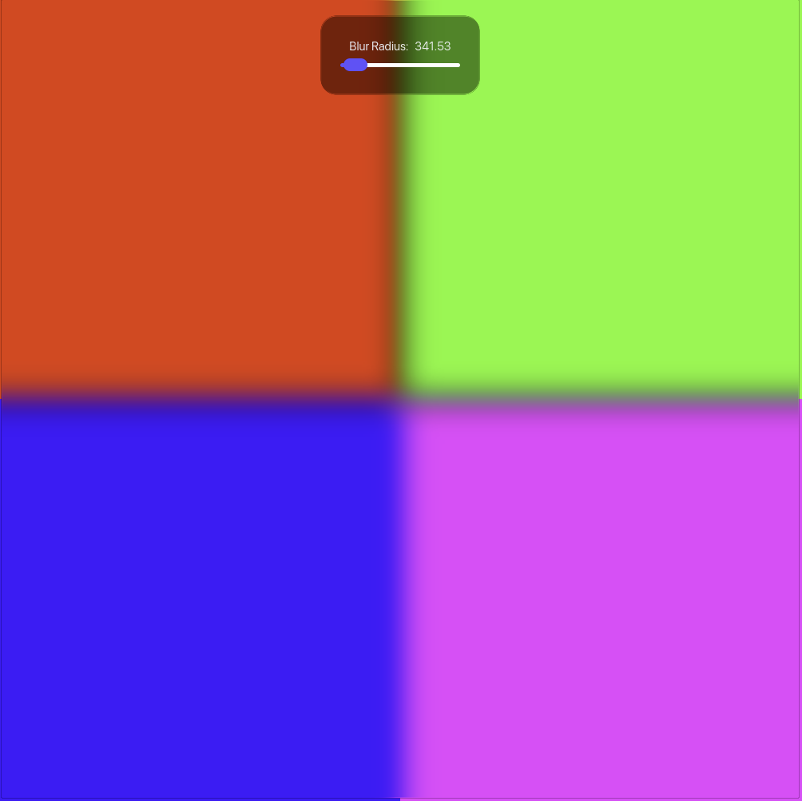
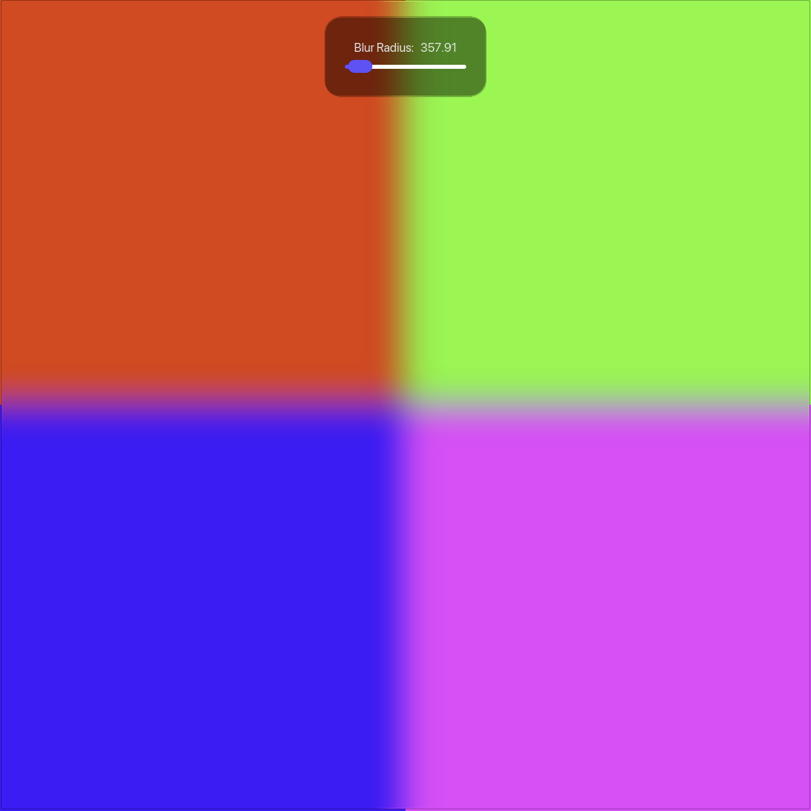

# Blur

This example showcases the handling of sRGB colors while blurring. In `gaussian.wgsl`, colors are transformed to linear space before being aggregated. At the end, the sum it converted back to sRGB and stored in the output texture. This causes the gaussian blur to be physically correct, and have a much nicer appearance.

## Example

<table>
<tr>
<td align="center"> <em>Incorrectly applied blur</em></td>
<td align="center"> <em>Correctly applied blur</em></td>
</tr>
</table>

