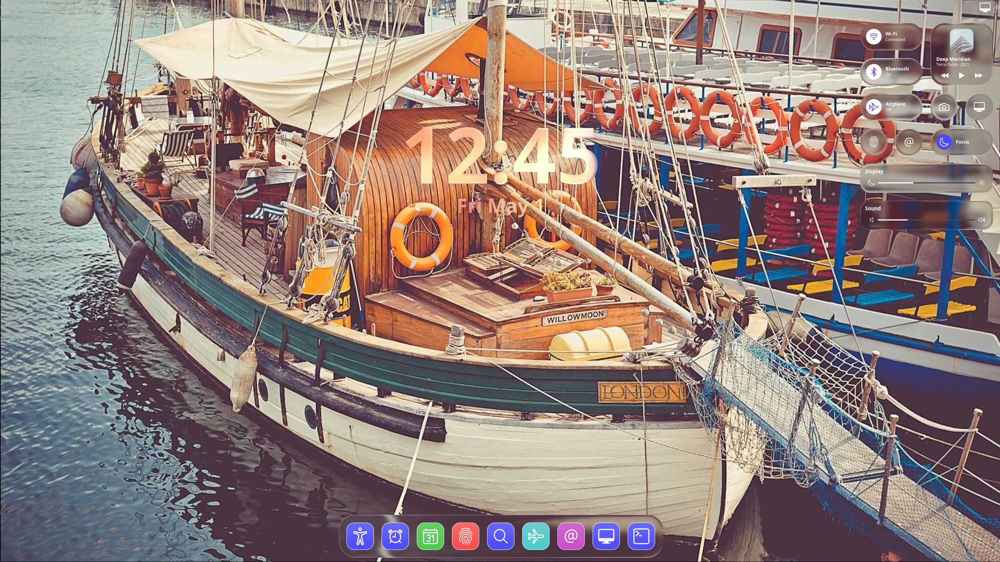

# Desktop

This example contains a simulated desktop environment, with a clock, an application dock at the bottom, and a settings menu in the top right. By clicking the menu button in the top right, the settings menu can be toggled.

There is no functionality linked to the buttons in the settings menu, it just showcases how the liquid glass effect can be animated through `iced`'s animation system.

## Example

    

